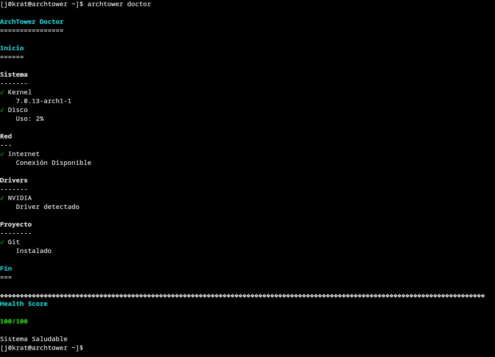
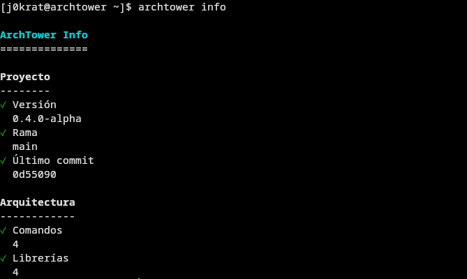
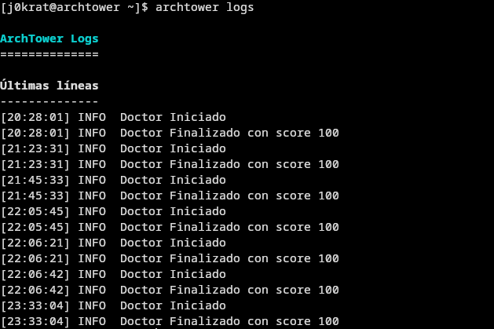

# ArchTower

> **Build your Arch Linux workstation with confidence.**

ArchTower es un toolkit modular para Arch Linux diseñado para construir, mantener y documentar una workstation de forma clara, confiable y reproducible.

Este proyecto nació como una reinstalación de Arch Linux con un objetivo simple: tener un sistema limpio para estudiar y trabajar. Con el tiempo evolucionó hasta convertirse en una colección de herramientas enfocadas en facilitar el mantenimiento diario de una instalación de Arch Linux sin perder de vista su filosofía.

---

# Características

* Arquitectura modular.
* CLI sencilla y extensible.
* Sistema de diagnósticos.
* Registro de eventos (logs).
* Documentación integrada.
* Filosofía Open Source.
* Pensado para aprender, no solo automatizar.

---

# Capturas

## ArchTower Doctor

Comprueba rápidamente el estado general del sistema y del entorno ArchTower.

```bash
archtower doctor
```



---

## ArchTower Info

Muestra un resumen del proyecto y del entorno actual.

```bash
archtower info
```



---

## ArchTower Logs

Consulta el historial de ejecuciones de ArchTower.

```bash
archtower logs
```



---

## ArchTower Version

Muestra la versión instalada.

```bash
archtower version
```


---

# Instalación

Clona el repositorio:

```bash
git clone git@github.com:j0krat/ArchTower.git
```

Entra al proyecto:

```bash
cd ArchTower
```

Concede permisos de ejecución al comando principal si fuese necesario:

```bash
chmod +x scripts/archtower
```

Puedes ejecutar ArchTower directamente:

```bash
./scripts/archtower doctor
```

O crear un enlace simbólico para utilizar el comando desde cualquier ubicación:

```bash
sudo ln -s "$PWD/scripts/archtower" /usr/local/bin/archtower
```

Comprueba que todo funciona:

```bash
archtower version
```

---

# Primeros pasos

Una vez instalado, puedes comenzar utilizando:

```bash
archtower version
```

```bash
archtower info
```

```bash
archtower doctor
```

```bash
archtower logs
```

---

# Comandos disponibles

| Comando             | Descripción                                        |
| ------------------- | -------------------------------------------------- |
| `archtower doctor`  | Comprueba el estado general del sistema.           |
| `archtower info`    | Muestra información del proyecto y la instalación. |
| `archtower logs`    | Visualiza los registros generados por ArchTower.   |
| `archtower version` | Muestra la versión instalada.                      |

---

# Arquitectura

ArchTower sigue una arquitectura modular.

```
scripts/
│
├── archtower
│
├── commands/
│   ├── doctor.sh
│   ├── info.sh
│   ├── logs.sh
│   └── version.sh
│
├── lib/
│   ├── config.sh
│   ├── colors.sh
│   ├── logger.sh
│   └── utils.sh
│
└── tests/
```

Cada comando tiene una única responsabilidad y reutiliza las librerías compartidas para mantener el proyecto limpio y fácil de mantener.

---

# Documentación

La documentación completa se encuentra en la carpeta `docs/`.

* ARCHITECTURE.md
* CHANGELOG.md
* CONTRIBUTING.md
* MANIFESTO.md
* ROADMAP.md
* TODO.md

---

# Filosofía

ArchTower se construye siguiendo cinco principios fundamentales.

* Claridad.
* Confianza.
* Simplicidad.
* Reproducibilidad.
* Aprendizaje.

El objetivo no es reemplazar Arch Linux.

El objetivo es acompañar al usuario mientras aprende y mantiene su sistema.

---

# Estado del proyecto

**Versión:** v0.4.0-alpha

**Estado:** Desarrollo activo.

ArchTower continúa evolucionando y nuevas funcionalidades serán incorporadas en futuras versiones.

---

# Contribuir

Si deseas contribuir al proyecto, consulta:

```
docs/CONTRIBUTING.md
```

Toda ayuda es bienvenida siempre que respete la filosofía del proyecto.

---

# Licencia

Este proyecto está distribuido bajo la licencia MIT.

Consulta el archivo `LICENSE` para más información.

---

# Agradecimientos

ArchTower existe gracias a la curiosidad por aprender, al deseo de construir herramientas útiles y a la convicción de que comprender cómo funciona un sistema siempre será más valioso que simplemente utilizarlo.

Si este proyecto te ayudó a aprender un poco más sobre Arch Linux, Bash o ingeniería de software, entonces ya ha cumplido uno de sus principales objetivos.

---

**No construimos scripts. Construimos confianza.**

**— Joaquín "j0krat" Vejar**
